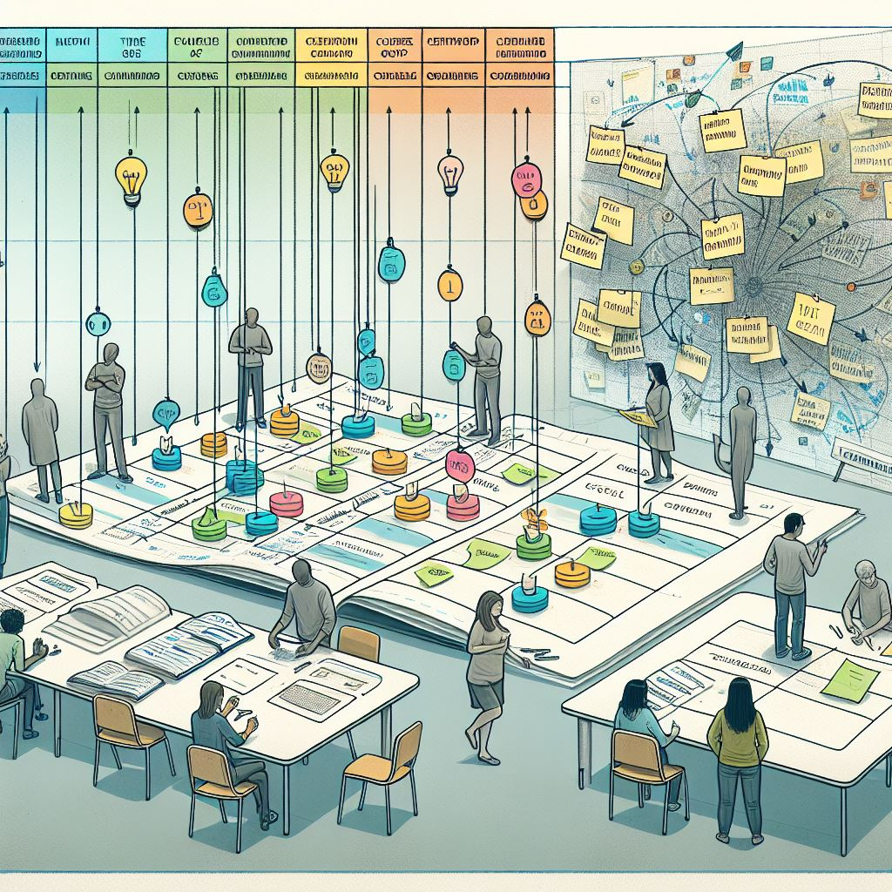

# Staff planning with the 
# Marker game

---

# Brief history

At DITE work was organized in _Core groups_;
each course was planned and 

---

# What?

- As Director of Studies at DITE, I carried out a “game” to plan staffing resources - _The Marker Game_.
  
- All staff participated in the event, and the goal was to staff all courses and determine where everyone’s working hours would be allocated.

- Although the primary goal was to staff all courses for the year, other activities such as projects, research time, and additional responsibilities were also included.

---

# What? contd

The game worked as follows:

- All courses were laid out on tables, as paper sheets, providing a chronological overview of the courses over the year.
- Hours for courses was based on a course budget, projects and had it's hours and other activities had fixed hour allocations, and so on.
- Each participant received tokens of different denominations, which together represented their annual working hours. Deductions were made for things like professional development, departmental duties, etc., so that those hours were “protected.”
- All participants then placed their tokens – that is, their time – on the courses (and other activities) they were going to be involved in during the year.

---
# Why?

I was Directory of studies @DITE with about 22 people.

The staffing planning at DITE was preceded by something called “**CORE GROUPS**”; for each corse a group of people was responsible for the planning and execution of it.

Over time, this became too fragmented; 
people were often involved in several different groups simultaneously, and the groups they were part of changed significantly throughout the year.

_Something else was needed_.

---

# Pros

| Pros | Cons |
|---|---|
Transparency | Time-consuming |
Participation and engagement | Physical presence |
Better understanding of the big picture | Unequal influence |
Encourages dialogue** and collaboration | Flexibility |
Practical problem-solving on the spot | Complex dependencies |
Visual and tangible | Documentation and follow-up |

---

# Advantages

Advantages:
Transparency:
Everyone can see how resources are allocated and what colleagues are planning to work on.

Participation and engagement:
Staff are actively involved in the planning process, which can increase their sense of ownership and motivation.

Better understanding of the big picture:
By viewing the full year’s course offerings and activities, everyone gains a clearer overview of the organization’s operations.

Encourages dialogue and collaboration:
Discussions naturally arise around priorities, workload, and coordination.

Practical problem-solving on the spot:
Since everyone is present, conflicts, double bookings, and other practical issues can be resolved immediately.

Visual and tangible method:
Planning becomes easier to grasp and manage when visualized with tokens and notes.

---
# Disadvantages:

**Time-consuming**
Gathering all staff and conducting the game can take a lot of time, especially in larger organizations.

Requires physical presence:
The method depends on everyone being in the same place at the same time, which can be challenging in hybrid or remote settings.

Risk of unequal influence:
Some individuals may dominate discussions or influence others’ choices, leading to imbalances in task distribution.