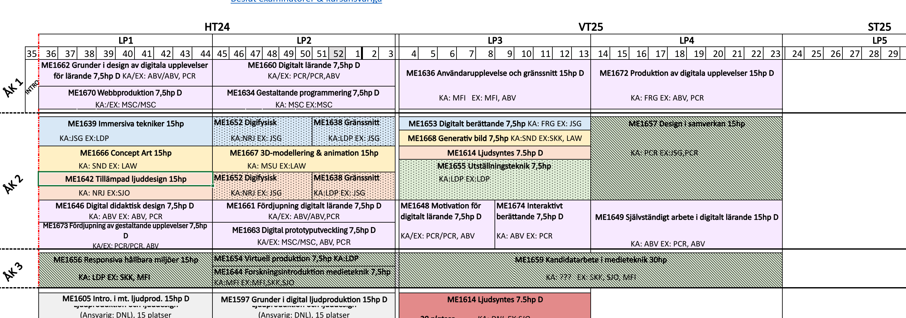
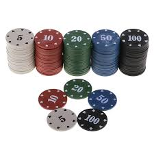

# Staff planning with the 
# Marker game

---

# Brief history

At DITE work was planned by the Director of Studies in _Core groups_;

each course was planned and executed by a small team, 3-5 co-workers.


Over time, this became too fragmented; 
 _involvment in several different groups/courses simultaneously_
 _groups changed significantly throughout the year_


```_Something else was needed_```

---

### history contd

We reorganiezed in larger teams (4-8);


**GOALS:**

- teams were constructed around programmes.

- each team were responsible for their 'own' planning; courses (and other activties) over the whole (academic) year.

- each team consisting of people with various roles teachers, researchers, course responsible, examiners 

- each team had a shared responsibility to plan and implement the activities that they had been committed or assigned to.


---

# Staff planning - The Marker game

- To plan staffing resources we did this as a board "game" - _The Marker Game_ (TMG).
  
- During one day, all staff participated in the event, and the goal was to staff all courses and determine where everyone’s working hours would be allocated.

- Although the primary goal was to staff all courses for the year, other activities such as projects, research time, and additional responsibilities were also included.


---

# TMG - How

The game worked as follows:

- All courses were laid out on tables, as paper sheets, providing a chronological overview of the courses over the year.
- Hours for courses was based on a course budget, projects, research and other activities had hour allocations.



---

### contd TMG

- Each participant received tokens (poker chips), which together represented their annual working hours. 
- Deductions were made for things like professional development, departmental duties etc
- Participants placed their tokens – their time – on the activities they were going to be involved in.

(_notes were also written on large post-its_)




---

### contd The Marker Game

When all colleagues had placed their markers, we went through everything and each person got to explain "why" and "how" and their thoughts.

Each team also tranfered their hours to Excel.


---

# Conclusion

| Pros | Cons |
|---|---|
Transparency | Time-consuming |
Participation and engagement | Physical presence |
Better understanding of the big picture | Unequal influence |
Encourages dialogue and collaboration | Flexibility |
Practical problem-solving on the spot | Complex dependencies |
Visual and tangible | Documentation and follow-up |


---

# Personal thoughts 

I hope, that in due time, we can move towards a way of working within more or less autonomous teams.

There are some challenges.
